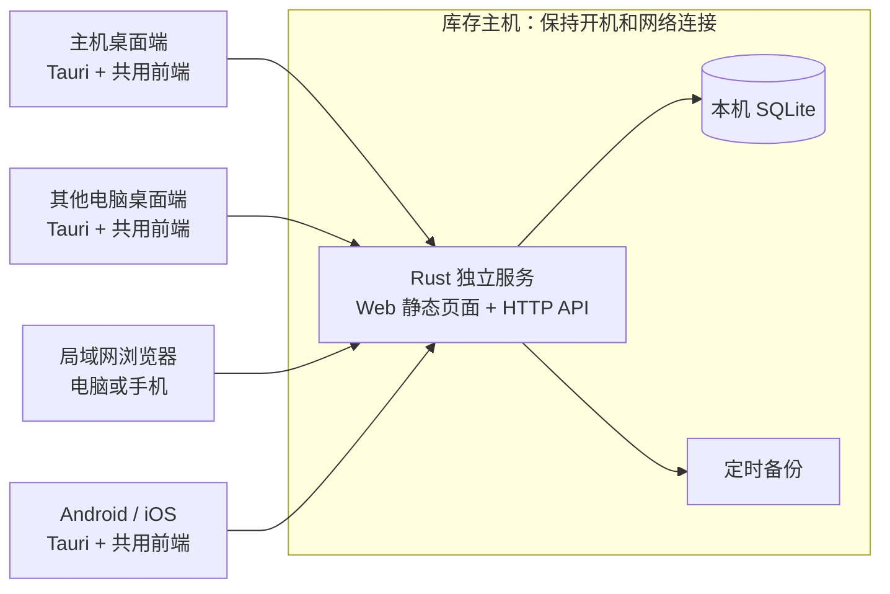

# Easy ERP：多人库存台账产品与技术方案

版本：V0.9，评审后待确认。日期：2026-10-04。数量台账、权限审计、备份与表格功能范围不变；补充输入约束、提示文案、问号帮助及六端易用性验收。数据层推荐 SeaORM，当前仅 SQLite。

本轮交付为产品、技术架构和 UI 设计方案；确认后才进入原型和代码开发。项目当前仅有方案文档，没有既有业务代码或技术栈需要兼容。评审结论与待落实事项见第 11 节。

## 1. 产品定位与建议结论

产品定位为“多人库存台账”，对工人直接叫“库存管理”。原材料、半成品、成品、辅料/耗材使用同一套物料资料与库存规则，通过类型区分。首版只关注数量、入出库、盘点、账号权限和操作记录，不做采购销售金额、财务和生产自动扣料。

单人、少量记录时 Excel 可以满足台账需求；本产品的价值在于把多人操作集中在同一份数据中，自动校验库存、避免并发覆盖、按账号限制操作，并记录谁在何时改了什么。首版不以复制完整 ERP 为目标。Excel 协作和版本历史也有作用，但本产品提供针对库存的事务、防重提交、岗位权限和业务留痕。

推荐方案：**Tauri 2 桌面/移动壳 + 独立 Rust 服务 + React/TypeScript Web 界面 + SQLite**。Tauri 与六端目标已由用户选定；后端由 Go 调整为 Rust 是结合性能讨论提出的推荐，随整体方案确认，不代表已经开始实现。

一套业务界面、一套业务 API、一份主机数据。主机装完整包，主要人员使用桌面端，其他人员在局域网打开浏览器。桌面端也可作为纯客户端连接另一台主机。

性能优先：工人电脑默认只运行浏览器页面或纯桌面客户端，不在每台电脑运行业务服务和数据库。完整安装包可以同时附带桌面端与服务可执行程序，但主机服务保持独立进程；安装在一起不等于嵌入同一进程。选型和验收以低配实机上的响应时间、总内存及后台 CPU 为依据。

“半系统服务、半桌面、半 Web”具体落地为三个职责明确的部分：

| 部分 | 负责什么 | 是否必须一直运行 |
|---|---|---|
| 库存服务 | 处理业务、保存数据、提供 Web 页面和 API、定时备份 | 多人使用时必须运行 |
| 桌面应用 | 显示共用界面、托盘、连接设置、本机服务状态 | 可关闭，独立服务继续运行 |
| 浏览器界面 | 工人及其他人员操作库存 | 随用随开，无需安装 |

当前按单公司、单局域网、一个主仓库、厂长 1 人及工人 2–3 人日常使用规划，20 会话作为扩展负载测试目标，不是性能承诺。暂不引入生产制造、财务总账、复杂审批、多门店同步。行业有批次、保质期、序列号要求时，应先补充模型再开发。

## 2. Tauri 与 Wails 的选择

两者都可以承载同一个 Web 前端，也都需要另行设计后台服务与局域网访问；选桌面框架本身不能自动得到多人 Web 系统。

| 维度 | Tauri 2 | Wails |
|---|---|---|
| 桌面技术 | Rust 原生壳 + 系统 WebView | Go 原生壳 + 系统 WebView |
| Windows/macOS/Linux | 均可作为目标，需要分别打包验证 | 均可作为目标，需要分别打包验证 |
| 共用 Web 界面 | 支持，业务通过 HTTP API | 支持，业务通过 HTTP API，避免依赖专用 Go 绑定 |
| 托盘及登录自启 | 有官方托盘 API 和自启插件 | 需按选定版本核实托盘、自启 API 和平台覆盖 |
| 独立系统服务 | 单独实现，桌面框架不承担服务职责 | 同样单独实现 |
| 配套后端成本 | 使用 Rust 后端时统一原生语言，但 Rust 开发复杂度较高 | 使用 Go 后端时语言更集中，业务开发通常较直接 |
| 适合的取舍 | 桌面能力优先，原生壳尽量薄 | 团队非常熟悉 Go，希望减少 Rust 维护 |

已选定 Tauri 2：托盘和自启已有官方接入路径，并支持 Android/iOS。推荐业务服务也采用 Rust，复用原生工具链；业务逻辑放在独立模块，不能依赖窗口事件循环。上表保留为选型依据，不再把 Wails 列为并行实现目标。

性能上不预设 Tauri 一定快于 Wails：二者都依赖系统 WebView，页面脚本、DOM 数量、WebView 子进程和刷新策略往往更影响客户端体验。独立服务位于主机时，不占用远程工人客户端的后台资源；Go 换 Rust 也不会直接降低这些客户端的内存。安装包大小不等于运行内存；验证需统计桌面壳及所有相关 WebView 子进程。

2026-10-04 查询 Wails 官方仓库 `releases/latest` 返回 v2.14.0、非预发布。Wails v3 文档访问遭遇站点校验，本次未核实其当前稳定性与平台能力，因此不把 v3 能力当成已验证前提。开发前锁定依赖版本，并用小样机验证桌面能力。

## 3. 总体架构：主机统一保存，所有端连接服务



- Rust 服务内嵌前端构建文件，Web 页面与 API 同源；没有 Node.js 运行时依赖。
- 桌面应用打包同一套前端构建产物，通过 API 连接本机或远程服务。仅“托盘、文件选择、服务管理”等使用桌面适配层，业务组件不直接调用原生绑定。
- 桌面内嵌界面只授予必要原生权限，不把任意远程网站放进具有原生权限的 WebView。
- 所有库存更改由主机服务执行；桌面、移动端和浏览器均不直接打开数据库。
- 使用 REST API；仅在可见业务页面建立 SSE 订阅，发送库存变更失效通知、合并刷新当前查询，不推送全库数据。隐藏窗口/页面暂停业务订阅和刷新，恢复可见时重新查询。SSE 不可用时退回仅可见页面的低频轮询，并在故障时退避。提交始终以后端事务结果为准。
- 开发期前端可使用开发服务器；交付后服务自己提供页面、登录和 API。

建议技术细分：React + TypeScript + Vite、Tailwind CSS、按需使用 shadcn/ui 无障碍基础组件；Rust + Axum 提供 HTTP 服务，SeaORM 访问数据，SeaQuery 构造查询，sea-orm-migration 管理结构迁移；首版 SQLite WAL 模式。常规访问使用异步驱动，备份等额外阻塞操作使用受控工作线程，不能阻塞异步 HTTP 执行器。这里是新项目的技术建议，尚未安装任何依赖。

### 3.1 三种安装/运行模式

| 模式 | 面向谁 | 运行方式 |
|---|---|---|
| 本机使用 | 单人试用、小规模起步 | 桌面启动本机用户级后台进程，默认仅回环地址；关闭窗口可留托盘 |
| 设为库存主机 | 多人共用的办公室电脑或小主机 | 安装独立服务，明确开启局域网共享；桌面只连接和管理 |
| 连接已有主机 | 其他主要人员 | 只运行桌面客户端，输入或扫描主机地址，不创建本地业务库 |

首次启动用“在这台电脑保存数据 / 连接已有库存主机”表达。需要多人访问时，引导把本机升级为库存主机；停掉用户级进程、迁移数据目录与权限、确认备份后启动系统服务，避免两个实例争用数据。

同一台机器、同一数据目录只允许一个服务实例；通过进程锁、端口检查和实例标识确认，不能只看到端口被占用就当成自己的服务。

### 3.1.1 一个安装包与一个可执行文件的区别

已确认：Windows、macOS、Linux 桌面安装包均包含 `easy-erp` 桌面应用和 `easy-erp-server` 无界面服务程序。用户安装一次，选择“本机使用 / 设为主机 / 连接主机”；不需要自行安装 Rust、数据库或另行部署后端。首版不另设桌面客户端专用包，连接主机模式下附带服务不启动、不注册系统服务，也不创建本地业务库；附带可执行文件只占磁盘，不产生服务运行开销。

Android/iOS 安装包仅包含客户端，不打包或启动业务服务，不创建主机业务数据库，不提供“设为主机”或服务自启入口。首次启动直接配置已有主机地址；本地仅保存必要的连接配置、凭据及草稿。Web 同样作为客户端使用。

| 组织方式 | 能否做到 | 生命周期与取舍 |
|---|---|---|
| 同一个进程内启动 UI 和 HTTP 服务 | 桌面可以自行实现 | 隐藏窗口后可继续服务，但退出或崩溃会一起停止；不能提供独立服务保障 |
| 同一个可执行文件提供 GUI / `--service` 模式 | 桌面技术上可设计 | 仍以两个进程运行；服务入口必须在 GUI 初始化前分流，并实现各平台服务协议；携带 GUI 依赖不利于无桌面 Linux 部署 |
| 同一个安装包包含两个可执行程序 | 推荐 | 安装体验统一，服务不依赖 GUI/WebView，独立启停和恢复，适合低配及无人登录运行 |

Tauri sidecar 能附带并启动服务程序，但不会自动注册 Windows Service、LaunchDaemon 或 systemd 服务。主机模式通过安装流程/受控本机管理入口注册，由操作系统管理服务，不能把普通 sidecar 子进程当作系统服务。服务入口不依赖 Tauri 窗口运行时，也不授予远程网页服务管理权限。

Rust 使用同一工作区管理共享业务模块、服务二进制和 Tauri 壳；构建时分开产物，安装时一起交付。这样既可一体安装，也能在无桌面 Linux 机器只部署服务。

### 3.2 常驻、关闭和开机自启

设置中分开显示两个开关：

1. **登录电脑后显示托盘**：可选，默认关闭。启动桌面程序并隐藏主窗口。
2. **电脑开机后提供库存服务**：主机模式可选，由管理员安装系统服务；无人登录时也可提供 Web。普通客户端无此开关。

| 平台 | 桌面托盘 | 登录后自启 | 无人登录服务 |
|---|---|---|---|
| Windows | 系统托盘 | 用户登录启动项 | Windows Service，专用服务身份 |
| macOS | 菜单栏图标 | 用户 LaunchAgent 等受支持机制 | LaunchDaemon，配置专用运行身份和数据权限 |
| Linux | 系统托盘，取决于桌面环境 | 桌面 autostart | systemd 系统服务，专用用户 |

服务安装/卸载需要系统授权；日常库存业务不需要管理员权限。服务进程不创建窗口或托盘，托盘由登录用户的桌面进程提供。Tauri 自启插件不能代替这些系统服务配置。

交互约定：

- 点击窗口关闭：在支持托盘时隐藏窗口，首次提示“已收起到托盘”。
- 托盘菜单：打开库存管理、服务状态、复制访问地址、打开网页版、设置、退出桌面程序。
- 主机模式退出桌面程序：服务继续运行；明确显示这条提示。
- 停止库存服务：仅本机授权管理入口，独立于“退出”，需明确确认，会中断其他人的使用。
- 本机用户级模式：退出时明确提示是否停止本机后台；无人登录后的持续运行不作保证。
- Linux 托盘不可用时：保留普通窗口/任务栏入口，关闭前告知行为，避免应用隐藏后无法找回。

主机关机或休眠后所有客户端无法记账；系统服务无法使休眠电脑持续提供 Web。建议主机接电、设为工作时段不自动休眠，或使用低功耗常开小主机；不自动修改用户电源设置。全盘加密要求开机解锁的设备，服务也只能在系统可用后运行。

### 3.2.1 六端能力边界

| 平台 | 共用业务界面 | 托盘/菜单栏 | 作为持续运行的库存主机 |
|---|---|---|---|
| Windows / macOS | Tauri 应用 | 支持，分别适配 | 支持，另行注册系统服务 |
| Linux | Tauri 应用 | 取决于桌面环境 | 支持 systemd，也可只装无界面服务 |
| Android | Tauri 移动应用 | 无桌面式托盘 | 本方案不支持，定位为客户端 |
| iOS | Tauri 移动应用 | 无桌面式托盘 | 本方案不支持，定位为客户端 |
| Web | 同一前端独立构建，由主机提供 | 无系统托盘 | 浏览器页面不充当服务主机 |

Tauri 2 支持五种原生目标，Web 来自共用前端的独立构建，不是把 Tauri 原生 API 直接搬进浏览器。原生插件需按平台隔离，服务管理与托盘只编入桌面目标；移动包不包含主机服务二进制。

Android 可开发受系统限制的前台服务并显示持续通知，但需要平台专门实现，也受后台策略影响；不适合作为本项目的无人值守库存主机。iOS 普通业务 App 会在后台被挂起，不能作为长期监听的通用局域网服务器。手机锁屏/切后台后不承诺继续请求，回到前台重新连接并确认未决提交，不能自动重复记账。

六端共用业务流程、类型和大部分界面，分别适配移动返回键、软键盘、安全区域、文件导入导出和凭据存储。局域网访问权限、Android 网络安全配置、iOS ATS 与证书信任分别验证，正式默认 HTTPS。Tauri 打包成功不等于六端功能和兼容性验收通过。

### 3.3 局域网接入与断线

- 共享默认关闭；管理员启用后选择可信网卡，展示访问地址和二维码。建议路由器固定 DHCP 租约，减少地址变化。
- 开启局域网共享前必须初始化管理员并开启登录；免登录仅允许本机使用。监听地址、登录模式与现有会话一起校验，避免通过配置切换产生未认证的远程业务访问。
- 不做公网端口映射。不同网段、访客 Wi-Fi 隔离、防火墙规则需在连接帮助中明确解释。
- 正式部署支持 HTTPS：可使用内网域名与受信证书，或本地 CA 加设备信任配置。桌面与浏览器都正常校验证书，不提供绕过校验的正式方案。
- 简易试用允许管理员明确启用 HTTP 局域网模式，并说明登录和业务内容不具备传输加密；不能把“内网”当作加密保证。
- 断线保留当前表单草稿，显示“未连接主机，尚未提交”；不允许离线扣库存，不伪装提交成功。
- 提交超时使用同一个幂等请求标识查询/重试，解决“主机已保存，客户端没收到回包”。
- 首版不做离线多机同步；这会引入库存冲突与额外学习成本。

## 4. 第一版业务范围

### 4.1 页面与操作

| 功能 | 工人看到的用语 | 第一版内容 |
|---|---|---|
| 工作台 | 我要入库 / 我要出库 / 查库存 | 三个大入口、本人最近操作、必要提醒 |
| 物料资料 | 物料 | 编码、名称、规格、类型、基本单位、可选条码、最低库存、启停用 |
| 收货 | 入库 | 收货、完工入库、退回、其他入库；记录物料、数量、可选来源和备注 |
| 发货/领料 | 出库 | 发货、领用、退回供应方、其他出库；记录数量、可选去向/领用人；报损由厂长操作 |
| 库存查询 | 库存 | 名称/编码/条码搜索、当前数量、最低库存提醒、收发记录 |
| 盘点 | 清点库存 | 输入实数、显示差异、管理员确认后生成调整记录 |
| 记录 | 出入库记录 | 按日期/物料/人员/类型查询，查看详情和作废关联 |
| 简单汇总 | 收发汇总 | 按物料、日期、类型查询收发数量；不同物料/单位不直接混成一个总数量 |
| 管理设置 | 设置 | 账号权限、主机连接、备份恢复、自启、局域网共享 |

第一版按实物实际收发记账。基础表单只要求物料与数量，用途按入口提供默认值；来源、去向、领用人按场景填写。来源/去向可以是简单文字，不要求先建客户供应商档案，不设置价格、金额或待补价提示。

每个物料先采用一个基本单位；不同规格建立不同物料。数量使用固定精度（建议最多 3 位小数，按单位限制），禁止二进制浮点直接记账。有流水后不能直接改变基本单位或数量精度；确需变更时建立新物料并通过有记录的库存转换流程处理。首版未实现转换功能前不提供此操作。

退回可关联原单，关联时校验累计退回量不超过原数量；无原单退回需管理员处理并记录原因。普通收发和退回使用正数量加明确方向，禁止用负数量绕过业务类型。

首版提供 Excel `.xlsx` 和 UTF-8 CSV 的物料/期初库存模板、导入预览与错误行报告，以及物料、当前库存、出入库记录和授权操作记录导出。期初库存通过期初单入账，不能直接改库存数；具体规则见第 7.2 节。旧 `.xls` 文件先另存为 `.xlsx` 或 CSV。

### 4.1.1 统一物料模型与数量台账

“商品”和“物料”在本系统中是同一个实体，界面统一称“物料”。类型预置原材料、半成品、成品、辅料/耗材、其他，首版用固定选项，供筛选和统计，不为每种类型开发独立台账。每个物料有唯一内部 ID，各自保存库存；名字相同但规格不同的物料不能混记。

类型只描述物料，并不执行转换。钢板是原材料、支架是成品，两者是两个物料；生产时登记钢板领用和支架完工入库，系统不推导用料比例。修改某物料类型只是分类更正，必须留痕，不产生原料转成品的库存效果。内部 ID 不变，流水保留当时物料信息快照。

| 实际场景 | 首版记法 | 对数量的影响 |
|---|---|---|
| 买来 100 个配件 | 收货入库，可填写来源 | 配件库存 +100 |
| 工人领走 20 个 | 领用出库，填写领用人/用途 | 配件库存 −20 |
| 未用完退回 5 个 | 领用退回，可关联原领用单 | 配件库存 +5 |
| 做好 10 个支架 | 完工入库 | 支架库存 +10；不自动扣原料 |
| 发走 10 个支架 | 发货出库，可填写去向 | 支架库存 −10 |
| 对方退回/退回供应方 | 关联原单的退回记录 | 分别增加/减少相应物料库存 |
| 损坏、丢失 | 报损出库，厂长填写原因 | 减少库存，保留报损原因 |
| 实盘发现差异 | 盘点调整单 | 厂长确认后增减库存 |

领用人和操作人是两个字段：厂长代工人登记时，操作人仍是厂长，领用人为实际领料者；不可通过手填姓名替换经过认证的操作人。关联退回累计数量不得超过原单可退数量；无原单退回由厂长处理并记录原因。

若以后需要采购销售金额或自动生产扣料，再扩展业务模块；首版不预建这些流程，也不把它们列为当前开工前必须回答的问题。物料资料并发编辑使用版本校验，避免厂长在两台设备上的修改互相覆盖。

### 4.2 岗位与子账号

| 角色 | 默认能力 |
|---|---|
| 厂长（管理员） | 全部记录、物料资料、确认盘点、报损、冲销作废、导入导出、账号与安全设置 |
| 工人 | 查库存、常规入库/出库及关联退回、查看本人操作记录、填写已发起盘点的实数；不作废、不改历史数量、不管理账号 |
| 只读人员 | 查看授权库存与记录，不能变更 |

针对当前规模，初始只需厂长及 2–3 个工人账号，不做部门树、自定义角色设计器或逐单审批。可在工人账号上选择“允许入库 / 允许出库 / 允许填写盘点”，角色模板给出默认值；厂长发起盘点并最终确认。物料维护、账号、作废、调整等管理权限不以零散开关下放给工人。

权限必须在后端执行，涵盖详情、搜索、导出、SSE 和历史快照，不能只隐藏按钮。工人查库存可看到物料数量，个人操作记录默认只看自己，完整操作历史由厂长查看。服务启停和备份恢复另受本机管理权限保护，不因拥有业务管理权限就自动获得远程系统控制能力。

### 4.3 可配置登录与子账号

两个可配置选项为“要求登录”和“启用子账号”。子账号依赖登录；业务数据和操作记录始终保留，不随关闭账号功能而清空。

| 使用模式 | 要求登录 | 子账号 | 操作记录归属 | 适用范围 |
|---|---|---|---|---|
| 本机简易模式 | 关闭 | 关闭 | 本机操作员，不声称识别个人 | 单人本机使用，服务仅监听回环地址 |
| 单账号模式 | 开启 | 关闭 | 当前管理员账号 | 仅一名操作者；可连接其专用客户端 |
| 多人岗位模式（本项目推荐） | 开启 | 开启 | 厂长/具体工人账号 | 厂长 + 2–3 个工人，桌面/手机/Web 共用 |

局域网业务访问必须登录，不提供免认证的远程库存修改。单账号模式不适合多人共用后追责：即使填写了“张师傅”，系统也只能证明管理员账号做过该操作。

配置与使用规则：

- 首次在主机本地完成初始化，设置厂长账号与密码；不提供出厂通用密码或开放的远程首管理员注册。初始化和账号恢复使用受操作系统权限保护的本机入口。
- 关闭“要求登录”前，必须关闭局域网共享、禁用子账号会话并确认退回本机模式；完成切换时撤销旧会话、断开远程订阅、关闭外部监听。配置与运行状态一致，否则拒绝切换。
- 关闭“启用子账号”后子账号不能继续登录，已有会话立即失效，保留账号 ID 和历史姓名快照；重新开启后由厂长显式恢复账号，不悄悄恢复全部停用账号。
- 启用子账号时由厂长新增、重置密码、停用；禁止停用最后一个有效管理员。权限变更、停用和重置密码会撤销相应会话，服务端不得只依赖前端缓存角色。
- 专人专用设备可选择“记住登录”，凭据有有效期且厂长可撤销；共享设备默认不记住，提供“切换人员”，切换必须验证目标账号。共享设备默认空闲 15 分钟锁定，可由厂长调整；敏感管理操作需再次验证身份。
- 无密码本机模式使用固定的本机操作员身份并保留内部用户 ID；本地接口仍需受保护的自动会话、Host/Origin 校验和 CSRF 防护，不能因只监听 localhost 就向任意网页开放操作。
- 本机免登录模式假定当前操作系统用户可信。启用登录可管理应用内岗位权限，但不能防止拥有主机系统管理权限的人直接修改数据库文件。

登录与子账号只影响身份与权限，不改变单据和流水结构。因此今后从单人切到多人，无需重新建库存账；早期本机记录仍显示“本机操作员”。

### 4.4 简单操作记录

操作记录始终开启，使用现有 SQLite 存储，不引入独立日志平台。前台提供一个可筛选的列表，厂长按人员、日期、动作或单号查询；工人只看本人授权范围，账号管理等记录不向工人泄露。

例：`10-04 10:32｜张师傅｜领用出库｜螺丝 M6｜20 个｜库存 120 → 100｜CK-000123`。

| 记录内容 | 规则 |
|---|---|
| 谁、何时、什么端 | 服务端确认的用户 ID、当时姓名、服务时间、Web/桌面/手机来源；来源设备信息仅辅助，不能代替用户身份 |
| 做了什么 | 新增/修改/停用物料、类型更正、入出库、退回、报损、确认盘点、作废、账号权限及登录设置变更、恢复备份 |
| 改了什么 | 关联单号或对象 ID、关键字段前后值、数量单位及余额、必要原因；多行单据详情展开显示 |
| 是否成功 | 成功业务写入与记录同事务提交；失败不产生成功记录。登录失败、权限拒绝等记录精简安全事件并控制频率 |
| 哪些不记录 | 不逐条记录浏览、搜索、键盘输入；不保存密码、令牌及完整敏感请求体 |

提交重试只产生一次成功业务记录；用户改名、停用或关闭子账号后，旧记录仍能正确显示。普通界面不提供删除/改写操作记录功能，记录随业务数据备份保留。它用于日常追溯，不能宣称抵抗主机管理员篡改；数据恢复也只能保留恢复点内的历史以及新追加的恢复事件。

## 5. 数据准确性与多人协作

推荐先使用 SQLite，数据库只放在主机本地磁盘；禁止放 SMB/NAS 共享目录供多人直接访问。多人通过同一个服务访问数据库。WAL 能改善读写并行，但写事务仍需串行，应缩短事务并配置合理等待与失败反馈。

核心数据：物料及类型、仓库（首版只展示默认仓库）、用户与权限、单据及明细、库存余额、不可变库存流水、审计记录、幂等请求记录、盘点单。物料停用代替删除，历史单据保留当时的名称、规格、类型和单位快照。来源/去向作为单据辅助字段，不另建采购销售或客户供应商业务模块。

关键规则：

1. 库存余额 = 已入账流水累计量；单据、流水、余额、成功操作记录和幂等结果在同一数据库事务中提交。
2. 默认禁止负库存。两人同时出库时，由事务中的条件校验与扣减保证不会超卖，不能只靠前端校验。
3. 单据提交后不能直接改数量或删除。管理员“作废”生成反向流水，保留原单、操作者、原因和关联；如反向操作会使库存为负，必须先处理后续库存关系。
4. 双击提交、网络重试和客户端重启后的同一请求不得重复入账；相同幂等键对应不同请求内容应拒绝。
5. 盘点默认按选中的物料锁定收发，厂长确认或取消后释放；这是数据库中持久化的业务状态，每笔写入检查，不能在工人清点的几分钟里一直持有 SQLite 写事务。界面向其他人显示“正在盘点，请稍后”。服务重启后保留盘点状态，厂长可见且可取消；锁定期间现场实际收发也应暂停，否则账面锁无法保证盘点准确。
6. 日期时间由服务记录，统一存储时刻，按配置时区展示；单号由服务生成并设置唯一约束。
7. 对关键表建立约束和索引；通过 SeaORM/SeaQuery 预留 SQLite、MySQL、PostgreSQL 三种后端。首版只实现并验收 SQLite，后续数据库启用须补充适配、数据迁移和实际数据库测试，不承诺无成本切换。

基础登录使用密码哈希、服务端会话、登录限速和退出失效，按第 4.3 节处理免登录与会话撤销。Web 使用合适的 Cookie 属性及 CSRF 防护；桌面/移动使用短期令牌，长期凭据交给各平台受支持的系统安全存储。CORS 仅允许明确配置的应用源和必要来源，不放开通配凭据访问。正式 HTTPS 会话使用 Secure Cookie；HTTP 试用模式单独显式配置，不能为了兼容试用而全局降低会话保护。

### 5.1 数据访问选型：SeaORM

用户所指的“sealorm”按 Rust 的 SeaORM 理解。推荐 SeaORM + SeaQuery + sea-orm-migration，驱动层使用其配套 SQLx；不再并列维护一套独立 SQLx 连接池或第二套 ORM。

| 方案 | 三库能力 | 对本项目的取舍 |
|---|---|---|
| SeaORM | 支持 SQLite/MySQL/PostgreSQL，实体、条件查询和迁移可复用 | 推荐，适合常规资料、分页、权限和台账；关键库存事务仍显式编写 |
| SQLx 直接访问 | 支持三库，但手写 SQL 方言及迁移通常需自行管理；Any 驱动不会统一所有 SQL 语义 | SQL 控制直接，适合偏 SQL 的团队；本项目跨库维护成本较高 |
| rusqlite | 聚焦 SQLite，可直接操作 SQLite 能力 | 适合只做 SQLite 的工具，不作为本项目主数据访问层 |

SeaORM 是 Rust 库，编入业务服务，不新增数据库服务进程。ORM 有对象映射及查询构造成本，不能宣称零开销；对当前少量人员，优先避免无索引查询、逐条关联查询（N+1）、超大结果集和长事务。若实测关键路径需要优化，可在同一事务连接中使用 SeaQuery 或参数化原生 SQL，不能绕过权限、幂等及审计规则。

2026-10-04 官方 GitHub 最新正式发布接口返回 SeaORM `2.0.4`，非预发布。以 2.0 稳定系列为候选，开发启动时核对 Rust 最低版本、Tauri/SQLite 依赖兼容性并锁定 Cargo.lock；SeaORM、migration 和 SeaQuery 使用兼容版本，不独立盲目升级。本文没有创建依赖文件或声称已通过编译。

### 5.2 当前 SQLite 交付与未来三库支持

| 范围 | 当前版本 | 后续启用时 |
|---|---|---|
| SQLite | 默认且唯一发布后端；随桌面主机服务内置 | 完整业务、迁移、备份恢复与并发测试 |
| MySQL | 预留后端边界与通用结构，不在安装包编入驱动，不提供可用配置入口 | 编入驱动，确定服务器版本/InnoDB/字符集，验证事务与迁移，接入数据库专用备份 |
| PostgreSQL | 同上，不声称当前已支持生产使用 | 编入驱动，确定版本，验证事务与迁移，接入数据库专用备份 |

首版在相关 Cargo 依赖和工作区中关闭不必要的默认 feature，只开启 SQLite、Tokio 和实体宏等必需功能；不因库支持三库就把三个驱动全部编入。ORM 与迁移依赖只进入服务程序，不进入 Android/iOS 客户端，也不进入桌面 UI 的依赖链；SQLite-only 构建必须核查工作区 feature 合并后是否意外引入其他驱动。HTTP 服务的 HTTPS 能力单独配置，不因 SQLite 驱动无需网络 TLS 就取消 HTTPS。

后续可按部署需要构建 MySQL、PostgreSQL 或多驱动服务版本；业务界面与客户端 API 无需因更换数据库重写。首版遇到未编入后端的配置应明确拒绝启动，不能默默创建 SQLite 空库。数据库类型/地址作为主机部署配置，不让工人在业务页面切换，更不能切换 URL 就把原数据当作已迁移。

代码层次保持简单：HTTP 接口调用库存/账号等业务服务，业务服务控制事务，数据访问模块使用 SeaORM/SeaQuery；数据库初始化、迁移、备份恢复中的方言差异集中在数据库适配模块。不为每张表创建多套重复实现，也不预先编写未测试的三套完整后端。

### 5.3 跨库数据与事务约定

- 数量使用带溢出检查的有符号 64 位整数保存最小计量单位，例如 `1.250 kg` 存 `1250`，界面按物料精度显示；避免依赖 SQLite 与 MySQL/PostgreSQL 不同的浮点或 decimal 行为。
- 主键优先采用应用生成的固定格式 ID，数据库中用通用字符串列保存；类型/状态使用稳定文本值并由服务校验，首版不使用数据库原生 enum、数组或强依赖 JSON 查询的业务字段。
- 时间使用明确的 UTC 表达（建议整数毫秒），展示时转本地时区；编码/用户名等唯一字段制定统一规范化规则及明确的比较语义，不能依赖三库默认排序规则恰好相同。
- 用 SeaQuery 编写建表、索引和通用查询；必要的方言 SQL 集中封装。应用校验与数据库唯一/外键/约束相互配合；SQLite 每个连接启用外键校验，并验证连接配置实际生效。
- 扣库存采用事务中的条件更新：仅余额足够且允许收发时扣减，检查影响行数；单据、流水、余额、成功操作记录、幂等结果必须使用同一事务对象。不能先查库存再在事务外写回计算结果。
- SQLite 没有与 MySQL/PostgreSQL 相同的行级锁能力；不能把 `SELECT FOR UPDATE` 当成三库通用正确性基础。盘点锁定与收发竞争也必须在事务内协调，未来 MySQL/PostgreSQL 适配需要实际并发测试。
- SQLite 配置 WAL、有限 busy timeout、可靠同步写盘和小连接池；增加连接数不能提高单写者吞吐。仅对可重试的竞争错误有限重试整个事务，沿用幂等键；未来死锁/序列化失败同样需要分类处理。
- 模式迁移有版本记录，启动业务前检查版本；不同后端的 DDL 与迁移自动事务包装不同，不能假定迁移失败都会自动回滚。SQLite 升级前备份，失败则停止开放业务并走恢复流程。

### 5.4 三库验收与备份边界

本轮只定义方案；开发阶段先验收 SQLite 的迁移、外键、并发出库、幂等、盘点、备份恢复和精度。以后增加 MySQL/PostgreSQL 时，使用真实数据库跑相同业务测试，另测唯一性比较、事务隔离、死锁重试、结构升级和恢复；能编译或成功连接不等于支持完成。

SQLite 完整快照不能直接导入 MySQL/PostgreSQL。后续跨库迁移需独立的数据转换/导入流程，核对条数、ID/关联、流水余额和审计归属，再切换主机配置。SQLite 使用文件快照，MySQL/PostgreSQL 使用对应数据库备份方案；SeaORM 不提供统一的跨库物理备份或自动迁库承诺。

SQLite 备份适配优先通过当前驱动可用能力完成一致性快照，例如经验证的 `VACUUM INTO` 或在线备份接口；具体方式在阶段 1 验证，包括快照期间写入延迟、磁盘用量和恢复可靠性。不能为获得备份 API 就直接引入与 SQLx 不兼容的另一版本 libsqlite3-sys；确需额外库时先验证单一 SQLite 原生依赖链。

## 6. UI / UX 方案

### 6.1 设计方向

已使用 ui-ux-pro-max 生成设计系统，并检索触控、表单错误、键盘和可访问性规则。采用其扁平风格、工业灰与绿色语义、清晰焦点和大触控区；检索结果中的营销单栏结构及在线英文字体不适合本产品，改为任务工作台与本地中文系统字体。

整体是“清楚、稳、少步骤”的生产工具：浅色背景、白色内容区、深色文字、清晰边框。工人首页不放复杂图表，不用只显示图标的按钮，不用 ERP 缩写。第一版先做浅色主题。

| 设计项 | 方案 |
|---|---|
| 页面背景 / 内容区 | `#F8FAFC` / `#FFFFFF` |
| 主文字 / 次文字 | `#0F172A` / `#475569` |
| 主操作 | `#334155` 深灰蓝，白字 |
| 入库/成功 | `#047857`，同时显示“入库/成功”文字 |
| 出库/提醒 | `#92400E`，配浅琥珀背景及文字说明 |
| 错误/作废 | `#B91C1C`，同时提供图标、原因和处理办法 |
| 边界 | 容器可用浅灰；输入框用更清楚的 `#64748B` 边界，焦点加明显外圈 |
| 中文字体 | 系统字体优先：PingFang SC、Microsoft YaHei、Noto Sans CJK SC、sans-serif；无需外网字体 |
| 字号 | 正文 16–18px；表单 18px；标题 24–28px；重点数量 28–36px |
| 尺寸 | 核心按钮至少高 48px；工人主按钮 56–64px；相邻可点击区间隔至少 8px |
| 布局 | 8px 间距体系，卡片内边距约 24px，圆角约 8px；不靠大阴影分层 |
| 图标和动效 | Lucide 线性图标配文字；状态过渡约 150ms，遵从减少动态效果设置 |

普通文字对比度目标至少 4.5:1，控件边界/焦点至少 3:1。后续实现逐项检查组合与状态，不将技能的风格推荐等同于已经通过无障碍验证。

### 6.2 桌面工作台线框

```text
┌──────────────────────────────────────────────────────────────────┐
│ 库存管理                 已连接 · 一车间主机        张师傅  [退出] │
├────────────┬─────────────────────────────────────────────────────┤
│ 工作台     │ 今天要做什么？                                      │
│ 库存       │                                                     │
│ 出入库记录 │ ┌──────────────┐ ┌──────────────┐ ┌──────────────┐  │
│ 清点库存   │ │ ＋ 我要入库  │ │ → 我要出库  │ │ 查库存       │  │
│            │ │ 收货、退回   │ │ 发货、领料   │ │ 找货、看数量 │  │
│            │ └──────────────┘ └──────────────┘ └──────────────┘  │
│            │                                                     │
│            │ [ 搜物料名称、编码或扫描条码                    ]   │
│            │                                                     │
│            │ 我最近的操作                         [查看全部]     │
│            │ 10:32  螺丝 M6       出库 20 个       已完成        │
│            │ 09:18  手套 L        入库 50 双       已完成        │
│            │                                                     │
│ 设置       │ 库存不足 3 种                         [查看]        │
└────────────┴─────────────────────────────────────────────────────┘
```

管理员额外看到物料维护、收发汇总和管理设置；工人不显示无权限入口。连接信息只在顶部显示可读状态，数据库、端口等细节放在管理员设置里。

### 6.3 核心操作：出库

主流程：**找物料 → 填数量 → 确认出库**。扫码枪按键盘输入兼容，首版不依赖摄像头扫码权限。

```text
┌──────────────────────────────────────────────────────────────────┐
│ ← 返回     我要出库                                               │
├─────────────────────────────────────┬────────────────────────────┤
│ 1. 选物料                           │ 本次出库                   │
│ [ 输入名称 / 编码 / 扫描条码      ] │                            │
│                                     │ 螺丝 M6                    │
│ 螺丝 M6 · 镀锌 · 个    现有 120     │ [ − ] [ 20 ] [ ＋ ] 个    │
│ 螺丝 M8 · 镀锌 · 个    现有 80      │ 现有 120 → 出库后 100      │
│                                     │                            │
│                                     │ 用途 [生产领用      ▾]     │
│                                     │ 领用人 [张师傅       ]     │
│                                     │ 备注   [选填         ]     │
│                                     │                            │
│                                     │ [       确认出库       ]   │
└─────────────────────────────────────┴────────────────────────────┘
```

- 默认直接填数量，多物料可继续添加；不强迫每次打开复杂明细表。
- 单位紧挨输入框，数值右对齐；切换物料时不静默沿用上一物料数量。
- 提交前显示当前库存和本次数量；提交成功后显示该笔实际入账后的库存，不显示推算余额。
- 正常提交不反复弹确认框；临近清空库存等异常情况才加强提示。
- 提交按钮显示“正在保存…”，防止重复点击；成功页显示“已出库 20 个”和单号，并提供“继续出库 / 查看记录”。
- 数量不足时就地显示“现在只剩 12 个，请修改数量”，保留其他字段；不能只给错误码。
- 未提交离开时提示保存草稿或放弃。草稿按用户和主机隔离，退出共享设备账号时清理本地草稿。
- 键盘 Tab 顺序合理，扫描回车只选中物料、不直接提交整单。

入库沿用相同布局；所有角色均无价格字段。发货可填写去向，领用显示领用人，避免无关字段一起出现；类型筛选采用“全部 / 原材料 / 半成品 / 成品 / 辅料耗材 / 其他”。

### 6.4 库存与记录页

库存页顶部固定搜索框及“仅看不足”筛选；主要列为名称/规格、库存、单位、状态、操作。库存量突出显示，点击物料查看最近出入库。物料编码作为辅助信息，不让用户依靠编码识别所有物料。

记录页默认今天，可切换近 7 天及自定义日期；用“入库 +20 个 / 出库 −20 个”同时表达方向与数量。详情显示操作人、时间、用途和关联作废；管理员作废入口放详情页并要求填写原因。

### 6.5 手机 Web 与异常状态

手机首页保留三个大入口，底部导航“工作台 / 库存 / 记录 / 我的”；表格改为物料卡片。出库页改为单列，已选物料放在当前表单下方，底部固定提交区并为软键盘和安全区域留空间。

| 状态 | 界面行为 |
|---|---|
| 首次无物料 | 显示“请管理员添加物料”，管理员提供“添加 / 导入” |
| 找不到物料 | 保留搜索词，提示尝试名称、规格或编码 |
| 主机断线 | 显示主机名称、重试和连接设置；已有数据标明最后更新时间 |
| 无权限 | 说明需要什么角色，不暴露账号管理等受限信息 |
| 提交结果未知 | 显示“正在确认结果”，查询同一请求，不提示用户新建重复单 |
| 操作完成 | 明确数量、单位、单号和下一步，不只用短暂提示条 |

响应式验收覆盖 375、768、1024、1440px；文字缩放至 200% 时仍可操作。工人应能在简短演示后独立完成找货、入库、出库；这需要真实用户试用确认，不能只靠设计者判断。

### 6.6 语义与辅助提示：一看就懂

易用性是首版交付标准，按 ui-ux-pro-max 的可见标签、就地校验、触控与键盘可达规则落实。工人页面使用生活中的动作名称，不显示 SKU、CRUD、冲销、幂等、数据库迁移等开发/财务词汇。

| 页面用语 | 可见解释/具体行为 |
|---|---|
| 入库 | “东西放进仓库，库存增加。” |
| 出库 | “东西拿出仓库，库存减少。” |
| 清点库存 | “填写实际数到的数量，厂长确认后更新库存。” |
| 物料类型 | “用来分类查找；把原材料改成成品，不会自动增减库存。” |
| 领用人 | “实际拿走物料的人，可以与当前登记人不同。” |
| 操作记录 | “查看谁在什么时候做了什么。” |
| 作废这笔记录 | 展示本次要冲回的具体数量及影响，例如“撤销这笔出库后，库存增加 20 个；原记录保留。” |
| 导出库存表 | “下载物料和当前数量，用 Excel 查看。” |
| 备份全部数据 | “保存库存、历史记录和账号，用于换机或恢复。” |

按钮写明确动作，如“确认出库”“保存物料”“确认导入 32 条”“恢复到 10 月 4 日 18:00 的备份”；避免所有操作都叫“确定/提交/处理”。单据详情展示“登记人”和“领用人”，防止误以为可通过修改领用人更改操作归属。

提示分层：

1. **必须知道的规则常驻显示**：必填/选填、单位、允许的小数位、当前库存、导入会影响哪些数据、恢复会覆盖哪些记录。不能藏在问号里。
2. **问号用于进一步解释**：基本单位、最低库存、物料类型、盘点差异、登录与子账号、自启与服务、备份与导出之间的区别；说明包含一句定义及一个具体例子。
3. **发生问题时就地提示**：指出哪里错、为什么、怎么改；已有输入保留。多个错误在表单顶部给简短汇总，可跳到对应字段。
4. **严重后果操作提前说明**：作废、盘点确认、恢复备份、停止主机服务等在确认前列出实际影响；普通收发不反复弹确认框。

不是每个字段都加问号，名称、备注等直观字段使用示例即可。补充说明按需展开，避免满屏帮助文字掩盖主要操作。

### 6.7 字段约束与示例

下表是实现默认规则，前端、服务端、导入模板使用一致的约束；服务端为最终依据。字符长度按统一的 Unicode 计数规则校验，不能前端按字、后台按 UTF-8 字节得到不同结果。页面约束有调整时，模板与帮助同步更新。

| 字段 | 输入约束 | 标签旁/框下提示示例 |
|---|---|---|
| 物料名称 | 必填，去除首尾空白后 1–100 字符；名称可重复但编码唯一 | “例如：镀锌螺丝”；选物料时同时显示规格、单位，避免同名选错 |
| 规格 | 选填，最多 100 字符 | “例如：M6 × 20 mm” |
| 物料编码 | 新建时自动生成，可在更多选项中设置，1–64 字符、唯一；按明确规范化规则检查冲突 | “可直接使用自动编号；有旧编号可在这里填写。” |
| 条码 | 选填，最多 128 字符，按文本保存、保留前导零；填写后唯一 | “用扫码枪扫描，或直接输入；没有条码可以不填。” |
| 类型 | 选择预置类型，可保留“其他” | “用于分类查找，不会自动增减库存。” |
| 基本单位 | 必选常用单位，厂长可维护其他单位；有流水后只读 | “按什么单位记数量？例如：个、件、公斤。” |
| 入库/出库数量 | 必填且大于 0；按物料允许精度输入，最多 3 位小数；上限由统一业务规则提供 | 整件：“请输入大于 0 的整数，单位：个”；称重：“单位：公斤，最多 3 位小数，例如 1.250” |
| 出库数量附加规则 | 不超过服务端最新可用库存，且物料未处于盘点锁定 | “当前可出库 120 个，提交时会再次检查。” |
| 期初/盘点实数 | 必填且 ≥0；空白表示未填写，0 表示实际没有 | “请填写实际数到的数量；没有请填 0。” |
| 最低库存 | 选填，≥0、与物料精度一致；留空不开启提醒，数量 ≤阈值时提醒 | “例如填 10，剩余 10 个或更少时提醒；填 0 会在用完时提醒。” |
| 来源/去向/领用人 | 按用途显示，最多 100 字符；领用人可选已有姓名或填写实际人员 | “实际领走的人；本次登记人仍是张师傅。” |
| 备注 | 选填，最多 500 字符；接近上限时显示字数 | “例如：用于 2 号设备维修” |
| 作废/报损/盘点差异原因 | 涉及相应变更时必填，去空白后 1–500 字符 | “请说明原因，例如：数量录错，实际领用 10 个。” |
| 姓名与账号 | 姓名用于显示，账号用于登录并唯一；创建时分别标明格式和长度限制 | “姓名：张师傅；登录账号可由厂长设置。” |
| 密码 | 明示服务端配置的长度规则，允许粘贴与密码管理器；显示/隐藏切换，不静默去空白或截断 | “专用设备可勾选记住登录；共用电脑请勿勾选。” |
| 主机地址 | 校验 http/https 地址、主机与端口，不要求工人理解数据库 URL；连接前显示将连接的主机身份 | “请填写厂长提供的访问地址，例如 https://stock.example.com” |
| 导入文件 | 明示支持 .xlsx/CSV、大小/行数上限和模板用途；选文件后后台校验内容 | “请使用物料模板；库存表不能作为备份恢复。” |
| 备份目录/时间 | 主机侧校验可写权限，时间显示时区；远程客户端不把本机目录误当成主机目录 | “文件保存在库存主机上；这里显示主机的时间。” |

数量输入不能静默截断小数、四舍五入为整数或把负数变正。不接受科学计数法或表达式；粘贴 `1,000` 等可能有歧义的数字时提示明确格式，不猜测数值。加减按钮不能越界，达到边界时显示原因；鼠标滚轮不能意外更改已填数量。加减步长由物料单位/精度决定，在帮助中说明。

允许正常输入的中间状态，例如刚输入 `1.` 时不立即报错，离开字段或提交时再验证；兼容中文输入法组合过程，不用逐键过滤破坏输入、粘贴和扫码。移动端整件使用数字键盘，称重使用小数键盘；仍须服务端校验，不能仅靠 HTML 输入类型。

### 6.8 校验、错误与操作反馈

- 字段有持续可见的标签，必填标“必填”、选填标“选填”；placeholder 只放示例，输入后标签和必要帮助仍在。
- 首次进入空表单不满屏报红。多数输入离开字段后校验；已报错字段在修改后及时更新，提交时做完整校验并定位首个错误。
- 普通必填错误保留可点击的主按钮，点击后指明缺什么。仅保存中、断线、无权限等实际不可执行状态禁用，并在附近解释，不能让用户猜灰色按钮的原因。
- 服务端错误映射到字段或页面状态，提供可读中文与下一步；技术错误码/请求编号仅放“查看详情”，不得原样显示 SQL 错误或堆栈。
- 库存并发变化提示“刚有其他人领用了这件物料，现在只剩 12 个，请修改数量”；更新可见库存但不擅自把用户的 20 改成 12。
- 保存时立即显示进度，成功明确显示物料、数量、单位和记录入口；不依赖短暂 toast 承载唯一结果。超时但结果未知显示“正在确认是否保存成功”，查回同一请求，不引导新建重复单。
- 错误、成功与提醒均使用文字配合颜色；字段提示关联到控件，错误可被读屏工具读出。常规提示不抢焦点，提交失败才定位错误。

示例：

```text
出库数量（必填）          单位：个
[ 20                         ]
当前可出库 12 个，只能填整数。
本次数量超过库存，请改为 12 个或更少。

领用人（选填）       [关于领用人 ?]
[ 李师傅                     ]
实际拿走物料的人。本次登记人：张师傅。
```

### 6.9 Tooltip、问号和触控帮助

- 桌面支持悬浮及键盘聚焦显示简短 tooltip；说明随鼠标进入提示区域保持可读，Esc 可关闭，不依赖浏览器原生 title 作为唯一帮助。
- 问号是可聚焦、可点击的帮助按钮，具有“关于基本单位”等明确辅助名称。点击打开说明浮层，移动端直接点开，不要求长按或模拟 hover。
- 短 tooltip 不放交互按钮；较长解释或带链接的内容使用可操作的 popover/小面板，有明确关闭方式与焦点返回。点击浮层之外或使用返回键按平台规则关闭，不丢当前表单。
- 问号图标可小，但实际点击区域按平台至少约 44–48 的触控尺寸，并保留间隔。浮层避开当前输入与软键盘，窄屏可改底部说明面板，不超出视口。
- 高频、必要规则直接展示；禁用按钮的原因也直接展示，不能只把 tooltip 绑在无法聚焦的禁用按钮上。物料全名或规格被省略时可点击展开，手机不靠悬浮看完整内容。

### 6.10 易用性验收

首版每个表单都要覆盖正常、空白、超长、粘贴、非法数字、超精度、越界、断线和重复提交；输入错误不得造成静默数据转换。不同角色、桌面键盘、手机触控的帮助与限制行为一致。

由厂长和至少一名实际工人试用：只给“入库 20 个、领用 5 个、查看谁领用、填写盘点数”任务，不口头解释每个字段；记录卡住的位置并修正文案。目标是看界面和就地提示即可完成，不能把“培训后熟悉了”当作界面易懂的唯一依据。

验收还包含：Tab 可遍历输入与问号、Esc/点击可关闭帮助、200% 文字缩放不遮挡主操作、375px 屏幕软键盘弹起后仍能看到错误和提交入口、读屏可读标签及错误、无权限和按钮禁用均有清晰原因。提示组件按需渲染，避免大量浮层常驻 DOM 影响低配性能。

## 7. 备份、导入导出、升级与部署

### 7.1 自动备份与完整恢复

备份是首版必备功能，由主机后台服务调度，不依赖桌面窗口或托盘。关掉桌面应用后系统服务仍可备份；主机断电、休眠或服务停止时不能备份。用户级本机模式只有后台进程运行时才执行备份。

| 设置/行为 | 推荐默认 |
|---|---|
| 定时任务 | 创建库存账后默认启用，每日 18:00，按主机配置时区；厂长可改时间或选择每小时 |
| 错过任务 | 下次服务启动发现错过备份时补做一次，不集中补做全部历史任务 |
| 保留策略 | 每日模式保留最近 7 个日恢复点与 4 个周恢复点；每小时模式额外保留最近 24 个小时恢复点，可配置 |
| 手动操作 | “立即备份”“导出完整备份”“从备份恢复”；与表格导入导出分开 |
| 保存位置 | 默认主机专用备份目录，可配置第二份复制到外部磁盘或服务身份有权限访问的位置 |
| 状态显示 | 最近成功时间、备份大小、下次计划、成功/失败状态；失败通知厂长，并提供明确原因 |
| 并发与失败 | 同一库存账只运行一个备份任务，失败有限次重试；不显示虚假成功，不因新备份失败清理旧备份 |

使用 SQLite 在线备份 API 或等效一致性快照机制，不能直接复制运行中的主文件而遗漏 WAL。先写临时文件、检查数据库完整性及校验信息，再发布完整备份；只有新恢复点验证成功才按保留策略清理旧文件，日/周保留标记取并集，不能误删仍在保留期的恢复点。任务运行在受控后台工作线程，限制重试和资源使用。

完整备份包含一致性数据库快照（物料、余额、单据、流水、账号密码哈希与角色、操作记录、业务配置）和清单（备份格式版本、数据库版本、生成时间、校验和）。TLS 私钥、操作系统安全存储、系统服务注册信息、设备路径不当作跨机器可迁移配置；换机后重新配置连接与服务安装，默认关闭外部共享。当前无附件；以后引入图片等文件时必须同步扩展完整备份范围。

备份文件按敏感业务资料管理，保存目录限制访问；完整备份导出/恢复只在主机受保护的管理入口执行，普通工人不能下载数据库。外部目标不可写时保留本地副本并明确提示“外部副本失败”，不能显示全部成功。本机同盘备份用于误操作恢复，不能防磁盘损坏，建议另存外部副本。

恢复流程：选择备份 → 验证格式、校验和和版本 → 展示恢复时间及将覆盖的数据范围 → 厂长确认并通过本机管理权限验证 → 维护模式停止新写入、等待在途事务完成并关闭连接 → 自动保存恢复前备份 → 恢复并检查 → 撤销全部旧会话/令牌、重新登录 → 记录恢复事件。验证或替换失败时保留原库并回滚，不留下半恢复状态；恢复前备份失败则不继续覆盖。

恢复会回到所选时点，之后的数据不会自动合并回来。恢复凭据使用备份内的账号资料；忘记密码走受保护的本机恢复入口。恢复后轮换会话失效标识，不能重新激活快照里旧的登录会话。

### 7.2 表格导入导出

| 功能 | 首版范围 |
|---|---|
| 物料导入 | `.xlsx` / CSV；编码、名称、规格、类型、单位、最低库存、可选条码；支持新增和明确选择更新资料 |
| 期初库存导入 | `.xlsx` / CSV；按物料编码填写初始数量，通过期初单入账；仅允许尚无库存流水的物料，零库存但有历史也不能再次初始化 |
| 库存盘点导入 | `.xlsx` / CSV；从已发起盘点导出的模板回填实数，绑定盘点 ID 和物料 ID，导入后仍需厂长确认差异 |
| 表格导出 | 物料资料、当前库存、出入库明细、操作记录；按当前筛选条件导出全部匹配行，不只导出当前分页 |
| 完整备份导出/导入恢复 | 第 7.1 节的备份格式；包含账号及历史，与 `.xlsx` / CSV 分开处理 |

导入流程固定为“下载模板 → 选择文件 → 预览与校验 → 确认导入 → 查看结果”。不直接覆盖已有库存；已有物料要改实数只能通过盘点调整。历史出入库明细的任意导入暂不支持，防止把导出记录重复记账；迁移旧 Excel 先导入物料与当前期初数量，旧表可另行留存。

按编码/内部 ID 匹配，名称不作为唯一键；编码和条码按文本保留前导零。校验重复编码、未知类型/单位、非数字、超精度、负数及重复行；重复代码不能静默覆盖。对于已存在物料，预览明确标出新增、更新或冲突，更新资料不能改已有库存和受限基本单位。盘点模板缺行表示未清点，不默认按零处理。

解析与校验在服务端受限任务中执行，不把表格库加进工人首屏。限制文件大小、解压后大小和行数；在受支持大小内，确认时重新校验版本、权限、期初状态和盘点状态，通过后整批事务提交，有错误整批不入账。超限先提示拆分文件，首版不做复杂的部分成功恢复机制。导入任务有幂等标识，网络重试不重复创建期初单；文件内容摘要可用于重复导入提醒，但不能阻止之后有意的新导入。

不执行上传表格公式或宏，数据字段要求实际值；文本导出避免被 Excel 当作公式执行，数量保持数值格式。预览错误指出具体行列并可下载错误报告。每次导入/导出记录操作者、时间、类型、条数及任务结果，不将整份文件内容写进操作日志。

导入和批量导出默认由厂长操作，工人不提供该权限；Web/桌面/移动使用同一后端授权，客户端通过浏览器下载或系统文件选择/分享入口接收文件。导出标注生成时间和筛选条件；库存表在一致性读取中生成，多个分页不能混用不同时间的库存状态。物料/期初/盘点模板明确标注用途，操作记录与出入库导出不是可直接回灌的模板。

表格导出不包含账号、完整审计关系或备份配置，不能代替完整备份。完整备份恢复才用于换机、故障恢复；表格导入用于接入现有 Excel 台账和批量录入。

### 7.3 升级与部署

- 数据目录与应用安装目录分开；系统服务目录权限由专用身份管理，卸载程序默认保留数据。
- 客户端/服务握手检查 API 版本；不兼容时说明需要升级哪一端。服务升级先备份，再迁移数据，失败进入可恢复状态；降级不能只替换旧可执行文件。
- 第一版使用明确维护窗口手动升级，避免业务中途后台升级；自动更新放后续。

发布目标包括 Web、Windows、macOS、Linux、Android、iOS。桌面初始测试矩阵为 Windows 10/11 x64、macOS Apple Silicon 与 Intel、Ubuntu LTS x64；移动以 Android/iOS ARM64 真机验证，最低系统版本随选定 Tauri、插件和设备实测锁定。Web 覆盖桌面主流浏览器及 Android Chrome/iOS Safari。Linux 无桌面服务器只装 Rust 服务。其他发行版、Windows ARM 和旧系统按实际需求增加，不把“跨平台”理解成所有历史系统都保证支持。

Windows 需处理 WebView2 运行环境；macOS 分发需签名/公证；Linux 需验证 WebKitGTK 与托盘环境依赖。离线安装包需考虑这些系统依赖。三平台使用各自构建与真机测试，不能仅在当前 macOS 编译一次就算完成。

Android 需要 SDK/NDK 与应用签名；iOS 构建需要 macOS/Xcode，设备分发需相应签名与描述文件，按 TestFlight、App Store 或适用的组织分发渠道交付。六端分别构建产物，无法交付一个通用于所有系统的可执行文件。移动端核心库存功能纳入本次产品目标，渠道发布安排在原型及真机验证后落实。

## 8. 开发阶段与验收门槛

### 8.1 低配置性能方案

“极致性能”优先落实为工人电脑少运行进程、少下载、少渲染、空闲不忙。桌面与 Web 共用界面的前提下仍需 WebView/浏览器运行时，不能承诺原生控件级别的内存占用。纯原生 UI 可另行评估，但会增加与 Web 的双界面维护成本，当前不作为默认方向。

| 环节 | 第一版约束 |
|---|---|
| 工人端部署 | 优先复用现有浏览器一个标签页；需要托盘才装纯桌面客户端。Web 与桌面哪个更省内存需测量，不能一概而论 |
| 前端依赖 | 保留 React/TypeScript 建议，按路由拆包；工人入口不加载报表、导入及管理组件，不引入整套重型表格和图表库 |
| 页面资源 | 本地提供资源、按需导入图标，不下载网络字体；压缩静态资源并按内容哈希缓存 |
| 首屏预算 | 工人入口所需 JS 合计 gzip 后目标 ≤150 KiB，CSS ≤30 KiB；包含必要共享依赖，后续懒加载资源单独记录 |
| 列表 | 默认服务端分页，每页 50 条；不把几万条记录下载到前端筛选。确需长列表时才使用虚拟滚动 |
| 搜索 | 普通输入约 200ms 防抖、取消旧请求、避免旧结果覆盖新结果；完整条码精确查找立即执行 |
| 查询 | 编码/条码用索引精确匹配，名称搜索按实际中文数据验证检索策略；返回必要字段，历史记录按日期和游标分页 |
| 刷新 | SSE 仅通知相关变更，合并短时间重复事件；不可见页面暂停业务刷新，返回后全量刷新当前页，防止漏事件 |
| 托盘 | 默认暂停页面活动；增加可选省内存模式，草稿安全保存后销毁业务窗口，点击托盘再创建。单纯隐藏窗口不会自动释放 WebView 内存 |
| 后台任务 | 导入分批校验与处理、导出流式生成，限制任务并发；备份避开忙时，SQLite 写锁期间不执行网络操作 |
| 数据正确性 | 保留事务和可靠落盘设置，不通过关闭同步写盘或省略校验换取跑分 |

省内存模式不影响独立主机服务，代价是重新打开窗口需要加载。托盘进程只保留必要菜单和轻量状态查询，不持续运行整页轮询；各平台是否释放全部 WebView 子进程由原型验证。

拟定基准客户端为低功耗双核 CPU、4GB 内存、集成显卡、SSD；CPU 型号、操作系统、浏览器版本须在测试报告固定，不能仅用“双核”概括结果。有 2GB 内存、机械硬盘、旧版 Windows 的设备需另测，不能直接套用该目标。主机采用独立记录规格的设备，基准使用有线局域网，另测现场 Wi-Fi。

以下为工程验收目标，尚未实测，不构成已经达到的性能声明：

| 指标 | 拟定目标与测量口径 |
|---|---|
| 输入与点击反馈 | 可见反馈 P95 ≤100ms，常规操作期间避免超过 50ms 的主线程长任务 |
| 首次打开 | 从打开地址/桌面启动到核心界面可操作目标 ≤2 秒；分别记录冷启动、热启动，首次安装运行时不混入 |
| 查库存 / 提交 | 端到端 P95 分别 ≤300ms / ≤500ms，提交包含可靠落盘；失败率和超时单独报告 |
| 客户端内存 | 工人工作台与 50 行库存页，桌面壳加 WebView 全部相关进程工作集目标 ≤200 MiB；浏览器单标签增量另测，共享进程内存说明归因方法 |
| 空闲 CPU | 无输入无库存变更时，连续 60 秒平均总系统 CPU 占比目标 <1%；桌面进程组汇总，记录操作系统计量方式 |
| 持续使用 | 连续重复打开、查询、提交、收起 2 小时后无持续内存增长趋势 |

基准数据暂定 1 万物料、100 万库存流水、20 个会话，其中 5 个会话各每秒一次读取、总计每秒 2 次写入；预热后测量至少 10 分钟，包含搜索和历史查询。该负载是验证样本，不是吞吐上限。冷启动另做多次重复测量，备份/导入并行时单独测退化情况。

技术验证阶段先在最低配置实机跑同一工人页面，定位脚本、布局、网络、SQL 或 WebView 开销。Tauri 已选定，优先优化具体瓶颈；目标无法达到时，明确结果并调整实现或设备下限，不擅自切换框架。Android/iOS 另在代表性低配真机记录启动、内存、软键盘交互与恢复前台表现，不直接套用桌面进程内存口径。

### 8.2 交付阶段

| 阶段 | 交付 | 通过条件 |
|---|---|---|
| 0：确认本方案 | 定位、框架、部署范围、UI 方向、账号与记录策略 | 用户确认后进入开发；第 11 节列明仍待落实的业务条件 |
| 1：技术验证与界面原型 | Tauri 托盘、独立 Rust 服务、共用前端、服务安装小样、六端核心页面原型 | 六端基本运行；桌面低配测试性能和托盘资源释放，移动真机验证局域网访问与前后台恢复；工人流程可理解 |
| 2：业务闭环 | 物料、期初、入出库、库存、盘点、可配置登录、子账号、操作记录、导入导出 | 账实规则、多人事务、身份模式切换和岗位权限测试通过 |
| 3：部署完善 | 自启、主机引导、HTTPS 配置路径、备份恢复、安装包 | 重启、退出、断线、恢复演练通过 |
| 4：现场试用 | 真实设备与数据、操作说明 | 至少一名实际操作人员完成入出库和盘点，修正问题后发布 |

必须验证的场景：

1. 主机窗口关闭及桌面程序退出后，独立服务仍让另一台电脑完成入库。
2. 开启服务自启后，主机重启且无人登录时，局域网 Web 可访问；关闭开关后符合设置。
3. 两人同时从 10 个库存各出库 8 个，只能一单成功，库存最终为 2 个。
4. 提交双击、断网重试不会重复入账；结果未知时能够查回原单。
5. 工人账号直接调用物料维护、作废、账号和权限管理接口仍被拒绝。
6. 盘点期间其他人不能更改被盘点物料；取消盘点后恢复操作。
7. 备份可在另一台测试主机恢复，单据、流水与余额相符。
8. 客户端模式不偷偷创建另一份库存库；连错主机时可辨认名称与实例。
9. 在代表性数据集上验证约 20 个会话的查询及混合写入；记录数据量、并发写入量和延迟，按结果确定支持规模。
10. 默认场景为厂长和 2–3 个工人分别登录，各自入出库正确记名，领用人与操作人可以不同，工人不能作废或改权限。
11. 免登录模式从外部设备不可访问业务 API；未初始化管理员或未开启登录时不能开启局域网共享。停用账号、关闭子账号或切换登录模式后，旧会话和订阅立即失效。
12. 事务回滚不留下成功操作记录；重复提交只记录一次；用户改名或停用后历史操作归属不变。
13. 更正物料类型产生前后值记录但不变动库存；盘点期间服务重启后状态仍可恢复或取消。
14. 原材料、成品各自独立记账，完工入库不自动扣原料；类型筛选和同物料收发汇总正确，不合计不同单位的数量。
15. 桌面退出后服务仍按时备份；错过任务在服务恢复后补做一次，失败可见且不会提前删除旧恢复点。
16. 持续入出库期间生成的完整备份可恢复，单据、流水、余额与操作记录一致；模拟损坏文件、磁盘不足和外部目录不可用，原库和已有备份仍完整。
17. Excel/CSV 的中文、前导零编码和数量精度往返正确；错误导入整批不变更，重复提交不重复入账，已有历史物料不能重做期初。
18. 盘点导入必须由厂长确认才改变库存；表格导出覆盖筛选后的全部行，完整备份权限不能通过远程下载接口绕过。
19. 按第 6.7–6.10 节验证输入约束和帮助：非法输入不静默转换，必需规则无需悬浮即可看见，问号支持鼠标、键盘及触控，真实工人能独立完成核心任务。

## 9. 待确认项与默认选择

确认时可直接说“按推荐方案做”，以下默认即作为第一版范围；如有差异，先修改方案。

| 事项 | 推荐默认 |
|---|---|
| 应用框架 | Tauri 2 已选定；独立 Rust 业务服务为当前推荐，SQLite 存储 |
| 数据访问 | SeaORM + SeaQuery + sea-orm-migration；当前仅 SQLite 构建与交付，预留 MySQL/PostgreSQL，后续分别适配验收 |
| 使用范围 | 一个公司、一个主仓库、厂长及 2–3 个工人；20 会话作为扩展验证负载 |
| 主机方式 | 支持普通电脑安装主机服务，推荐工作时段常开设备 |
| 低配优先 | 工人电脑只运行界面；按第 8.1 节在最低配置实机验收，不按框架名称推断性能 |
| 支持平台 | Web、Windows、macOS、Linux、Android、iOS；具体最低版本在技术验证锁定 |
| 打包方式（已确认） | Windows/macOS/Linux 安装包带服务，按运行模式启动；Android/iOS 不带服务，Web 连接已有主机 |
| 开机启动 | 服务开机启动与桌面登录启动分别可选，未经选择不自动启用 |
| 登录与子账号 | 多人默认都开启；单人可关闭子账号，本机可关闭登录；局域网业务访问要求登录 |
| 岗位与记录 | 厂长管理、工人收发；成功变更自动留痕，无逐单审批，操作记录不能在应用中关闭或删除 |
| 核心业务（已明确） | 物料分类、数量入出库、领用退回、报损、查库存、盘点、权限与操作审计 |
| 自动备份（已要求） | 主机服务定时执行，支持立即备份、可配置保留策略、外部副本与完整恢复 |
| 导入导出（已要求） | `.xlsx` / CSV 模板、预览校验、物料/期初/盘点导入、库存/流水/操作记录导出 |
| 金额/生产 | 首版无价格、金额、采购销售订单、财务、成本利润、BOM 或自动生产扣料 |
| 特殊库存 | 默认无批次、保质期、序列号、单位换算；如行业需要必须提前调整 |
| UI | 中文、浅色、大按钮，工人简化界面，桌面/Web 共用 |
| 易用性（已要求） | 可见字段标签、单位/限制/示例、就地错误与恢复动作；补充问号说明支持悬浮、键盘和触控，纳入真实工人验收 |
| 离线 | 可保留草稿，记账必须连接主机 |

已明确原材料和成品统一按物料管理，只以类型区分，关注数量。尚需落实的是有没有“按箱进、按个出”、多仓、批次/保质期或序列号需求；若没有，采用单仓、单基本单位和无批次的默认范围即可，不再追问金额或生产核算。

## 10. 资料与核验边界

- Tauri 托盘：https://v2.tauri.app/learn/system-tray/ （已查阅；Linux 托盘部分事件存在平台限制）
- Tauri 自启：https://v2.tauri.app/plugin/autostart/ （已查阅；示例包含 macOS LaunchAgent）
- Tauri 平台与构建入口：https://v2.tauri.app/start/
- Tauri 附带外部程序：https://v2.tauri.app/develop/sidecar/ （已查阅；打包外部程序与注册系统服务是不同步骤）
- Wails 官方最新发布：https://github.com/wailsapp/wails/releases/latest （已通过官方 GitHub API 查询）
- Wails v3 文档：https://v3.wails.io/ （本次访问被站点校验阻挡，未作为已核实能力依据）
- UI 依据：本地 ui-ux-pro-max 技能设计系统与 UX 检索；已结合中文工人操作场景进行取舍。
- SeaORM 数据库与运行时：https://www.sea-ql.org/SeaORM/docs/install-and-config/database-and-async-runtime/ （已核实三种驱动可按 feature 选择）
- SeaORM 迁移：https://www.sea-ql.org/SeaORM/docs/migration/writing-migration/ （已核实 SeaQuery 跨库支持及迁移事务差异）
- SeaORM 事务：https://www.sea-ql.org/SeaORM/docs/advanced-query/transaction/
- SeaORM 正式发布：https://github.com/SeaQL/sea-orm/releases/tag/2.0.4 （本次通过官方 GitHub 最新发布 API 核验）
- SQLx 说明：https://github.com/launchbadge/sqlx （已核实三库支持、Any 驱动与 SQLx 非 ORM 的定位）

本文件是待确认的设计，不代表服务安装、兼容性、安全检查、性能或 UI 用户测试已经完成。这些按上述阶段验收。

## 11. 本轮评审：是否可以开始执行

结论：数量台账定位已明确，架构和核心业务具备开始阶段 1 的条件；按最初约定，本轮业务澄清和文档修订不等于正式授权开发。整体方案确认后可开工，剩余单位和特殊库存条件在阶段 2 建模前落实。不能把文档评审通过等同于六端性能、安装和生产可用性已经验证。

### 11.1 评审发现与处理

| 重要程度 | 原方案缺口 | 处理结果 |
|---|---|---|
| 高 | 可关闭登录与多人操作追溯存在冲突，切换模式可能留下旧会话 | 第 4.3 节限定本机免登录，明确子账号依赖、管理员初始化、会话撤销及真实归属 |
| 高 | 把数量台账扩大成采购销售和生产管理，会增加无用流程 | 已收敛为统一物料、数量收发；首版不包含金额、订单或自动扣料 |
| 高 | 原材料/成品类型可能被误用为生产转换 | 类型只分类；原材料和成品各自独立物料、独立库存，类型更正不产生库存变化 |
| 中 | 盘点“锁定”没有区分业务锁与数据库长事务 | 第 5 节明确持久化业务状态、重启恢复和现场暂停收发，避免全库写入长时间阻塞 |
| 中 | 只有“审计记录”名称，未定义岗位可见范围及可靠写入 | 第 4.4 节定义简单列表、内容、事务一致性及身份保留，不新增日志服务 |
| 中 | 实际团队只有 3–4 人，易过度设计组织与审批 | 用厂长/工人模板及少量操作开关，20 会话只作为性能测试 |
| 中 | 六端目标容易被理解成一次打包即可交付 | 保留六端最终范围，按共用业务闭环、桌面服务、移动适配逐步交付，各端单独验收 |

### 11.2 业务模型前要落实的事项

| 问题 | 默认假设 | 为什么影响实现 |
|---|---|---|
| 有没有按箱买、按个领，或按重量计量 | 一物料一个基本单位；可直接填写换算后的基本数量 | 自动单位换算、称重精度不能事后只加显示字段解决 |
| 是否有多个仓库、批次、保质期或序列号 | 单仓，无特殊追踪 | 库存余额唯一键、出库选择和追溯模型会改变 |

不需要在原型前设计完整 ERP。若上述默认符合现场，第一版按此执行；若尚未回答，只推进不依赖这些选择的技术与交互验证，不将默认假设视为已确认事实。

推荐执行顺序：先验证 Rust 服务 + SQLite + Web 登录与一条入出库闭环，再接桌面托盘/服务安装，移动端复用相同 API 和页面完成适配。六端构建骨架可以尽早验证，但不同时复制六套业务实现。真实工人试用和最低配置实机测试应在扩大页面范围前进行。
